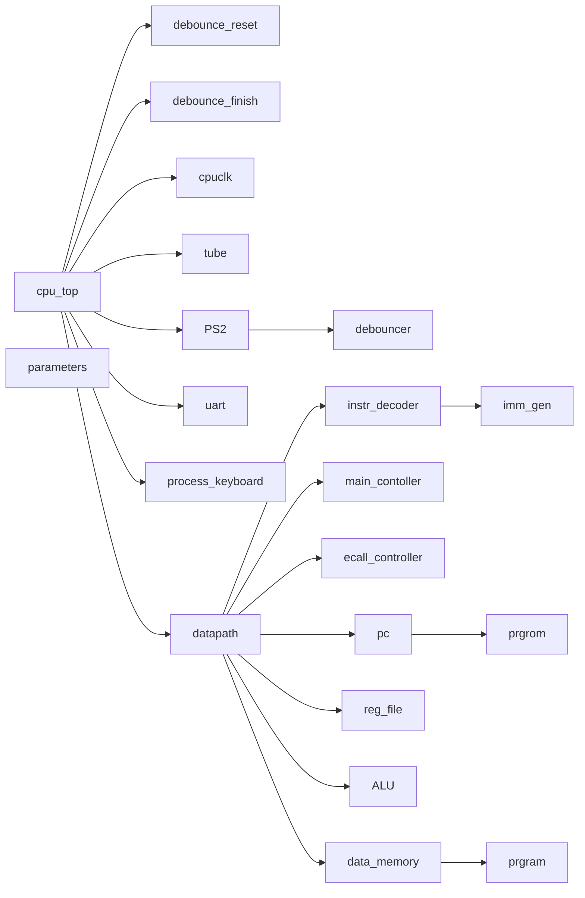

# Computer-Organization-Project-Documentation-CPU-Design

---
This page is live on NOTION, click the following link for better reading experience

https://respected-llama-d66.notion.site/Computer-Organization-Project-Documentation-CPU-Design-02267c04d8cc42b2948275ba1ce84377?pvs=4

[https://github.com/naivecynics/Computer_Orgnization_Project.git](https://github.com/naivecynics/Computer_Orgnization_Project.git)

---

# 0. Directory

---

# 1. Developers Information

---

## （1）Contribution Ratio

> WYT 吴雨潼 12213012   3Mker                       33.3%
QKT  秦恺通 12212606   IRONMAN1024        33.3%
HLC  黄朗初 12213009   naivecynics               33.3%
> 

## （2）Directory Catalog

```rust
.(git)
├── README.md
├── .gitignore                  // ignore ip core configuration files
│                               // instruction PDFs
├── CPU大作业测试说明.pdf
├── Computer Orgnization大作业-cs202-release.pdf
├── Ego1_UserManual_v2.2.pdf
├── Minisys硬件手册1.1.pdf
├── RISC-V-Reference-Data.pdf
│
├── Schematic.png               // Schematic of the project
├── Design_DIagram.jpg          // Reference design diagram
│
├── constrs_1                   
│   └── new
│       ├── eg01.xdc            // eg01 constrs file
│       └── minisys.xdc         // minisys constrs file
├── new
│   │                           // cpu core module
│   ├── ALU.v
│   ├── cpu_top.v
│   ├── data_memory.v
│   ├── datapath.v
│   ├── ecall_controller.v
│   ├── imm_gen.v
│   ├── instr_decoder.v
│   ├── main_controller.v
│   ├── parameters.v
│   ├── pc.v
│   ├── reg_file.v
│   │   
│   ├── hardware_top            // hardware top module
│   │   ├── PS2.v
│   │   ├── debounce.v
│   │   ├── hardware_top.v
│   │   ├── keyboard_debouncer.v
│   │   ├── keypad_minisys.v
│   │   ├── process_keyboard.v
│   │   └── tube.v
│   │   
│   ├── assemble                // assemble test code
│   │   ├── lastest.asm
│   │   ├── scene1.asm
│   │   ├── scene2.asm
│   │   └── text_to_coe.py
│   │   
│   ├── bin_to_coe              // final bitstream
│   │   ├── a_tailed_risc-v_CPU_CSE.bit
│   │   ├── final_1.0.bit
│   │   ├── test1.bit
│   │   └── test2.bit
│   │   
│   ├── tools                   // toolchains
│   │   ├── bin_to_coe.py       // any base to coe 
│   │   ├── coe_to_uart_txt.py  // coe to uart txt
│   │   ├── riscv32_to_coe.sh   // linux riscv32 to coe
│   │   ├── scene1.asm
│   │   ├── scene1.coe
│   │   ├── scene1.txt
│   │   ├── scene2.asm
│   │   ├── scene2.coe
│   │   ├── scene2.txt
│   │   ├── scene2_keyboard.asm
│   │   ├── scene2_keyboard.coe
│   │   └── scene2_keyboard.txt
│   │   
│   └── uart                    // uart tools and txt
│       ├── GenUBit_RISC_V.bat
│       ├── UartAssist.exe
│       ├── rars2coe.exe
│       ├── scene1.txt
│       ├── scene2.txt
│       └── scene2_keyboard.txt
└── sim_1                       // simulation files
│   └── new
│       ├── controller_tbc.v
│       ├── cpuclk_tbc.v
│       ├── keypad_tbc.v
│       ├── top_tbc.v
│       └── tube_tbc.v
└── END
```

# 2. Development Github Log

---

```bash
$ git log --graph --pretty=format:"%h - %an, %ad : %s" --abbrev-commit --date=short

* cfbbe33 - naivecynics, 2024-06-03 : final
* 0b85c8c - naivecynics, 2024-06-03 : final wind up
* 9ad3ec2 - IRONMAN1024, 2024-06-02 : update
* a19269c - naivecynics, 2024-06-02 : ecall +1
* c6c2c0b - IRONMAN1024, 2024-05-27 : qkt111
* 7178d68 - IRONMAN1024, 2024-06-01 : uart_top
* f5d6612 - naivecynics, 2024-06-01 : keyboard debug
* b10839c - 3Mker, 2024-05-31 : update
* 61ebb2d - Langchu Huang, 2024-05-31 : GNU toolchain added
* f7529a5 - 3Mker, 2024-05-27 : update
* d7eefa7 - 3Mker, 2024-05-27 : update
* 818ab03 - naivecynics, 2024-05-27 : block ecall signal
* 5ec146b - 3Mker, 2024-05-27 : update
* e0b856e - 3Mker, 2024-05-24 : wytnew
* 6b8039e - 3Mker, 2024-05-24 : wyt
* 5f8d2a8 - naivecynics, 2024-05-27 : update so many things
* 6aa1991 - naivecynics, 2024-05-24 : all
* 5f49526 - naivecynics, 2024-05-22 : beq_debug_passed
* 7903d8e - naivecynics, 2024-05-22 : hlc_pc_ecall
*   79de483 - 3Mker, 2024-05-22 : Merge branch 'master'
|\  
| * 34583b7 - naivecynics, 2024-05-19 : update
| * eefa048 - naivecynics, 2024-05-19 : hardware drive
* | ef86eef - 3Mker, 2024-05-22 : wyt update
|/  
* 044aab3 - 3Mker, 2024-05-19 : preliminary
* 803806d - IRONMAN1024, 2024-05-17 : modified
* 7ffa890 - IRONMAN1024, 2024-05-15 : update
* 3159544 - IRONMAN1024, 2024-05-15 : i_fetch
*   9f38ff1 - 3Mker, 2024-05-15 : Merge branch 'master'
|\  
| * 4ed4f12 - Langchu Huang, 2024-05-15 : debug: executable
| * 429350b - Langchu Huang, 2024-05-15 : add gitignore
| * d696e3c - Langchu Huang, 2024-05-13 : supplement
| * aae18a1 - naivecynics, 2024-05-13 : 1.ip setting 2. compile passed 3. add instr mem
* | e58b73e - 3Mker, 2024-05-15 : asm
* | 2fe8b4c - 3Mker, 2024-05-15 : add asm sample
|/  
*   0530bc9 - 3Mker, 2024-05-12 : Merge branch 'master' 
|\  
| * 209217f - IRONMAN1024, 2024-05-12 : datapath finish!
| * e65fdf4 - IRONMAN1024, 2024-05-12 : PC
* | 603b2dc - 3Mker, 2024-05-12 : update_decoder
|/  
* 0a1e25c - naivecynics, 2024-05-12 : 7tube
* 176f4c7 - naivecynics, 2024-05-12 : update
* f84d546 - naivecynics, 2024-05-12 : updatae
*   4f75181 - 3Mker, 2024-05-12 : Merge branch 'master' 
|\  
| * 75b0698 - IRONMAN1024, 2024-05-07 : ALU
* | 79f601c - 3Mker, 2024-05-12 : update
|/  
* ab2d3d2 - naivecynics, 2024-05-06 : ip core
* ba0e660 - naivecynics, 2024-04-29 : add readme
* 236aa23 - naivecynics, 2024-04-29 : delete trash
* 138b17c - naivecynics, 2024-04-29 : previous cpu design
```

# 3. CPU Architecture Design

---

## （1）CPU Information Card

| CPU时钟 | CPI | CPU周期 | Pipeline |
| --- | --- | --- | --- |
| 23MHz | 1 | 单周期 | nonsupport |

| 寻址空间设计 | 寻址单位 | 指令空间 | 数据空间 | 栈空间的基地址 |
| --- | --- | --- | --- | --- |
| 哈佛结构 | Byte | $2^{14} $ Bytes | $2^{14}$ Bytes | $2^{10}$ Bytes |

| 外设 I/O 支持 | I/O 访问方式 |
| --- | --- |
| MMIO | 中断访问 |

## （2）Instruction Set Architecture

- 支持所有本课程 reference card 中的 RV32I Base Integer Instructions 除了ebreak之外的所有指令，ecall实现了与硬件交互的输入功能。
- 对应编码和使用方式与本课程 reference card一致
- 寄存器规格同样参考本课程 reference card 中的 register 规格要求，32位，32个。

## （3）CPU Ports

| cpu_top ports | 位宽 | 类型 | 说明 |
| --- | --- | --- | --- |
| clk_100 | 1 | input | 100Mhz时钟 |
| rst_n | 1 | input | 复位信号 |
| keyboard_clk | 1 | input | 键盘时钟 |
| keyboard_data | 1 | input | 键盘数据 |
| finish | 1 | input | 确定按键 |
| switch | 8 | input | 8个拨码开关 |
| small_switch | 8 | input | 8个小拨码开关 |
| tube_scan | 8 | output | 数码管扫描信号 |
| tube_signal_left | 8 | output | 左数码管信号 |
| tube_signal_right | 8 | output | 右数码管信号 |
| led | 8 | output | led灯 |
| small_led | 8 | output | 小led灯 |
| tx | 1 | output | send data by UART |
| rx | 1 | input | receive data by UART |
| start_pg | 1 | input | Active High |

## （4）CPU interior structure




## （5）Submodule ports specifications and functions

| 模块名称：debounce_reset | 位宽 | 类型 | 说明：信号复位消抖 |
| --- | --- | --- | --- |
| clk | 1 | input | 100Mhz |
| temkey | 1 | input | 初始复位信号 |
| finalkey | 1 | output | 消抖后复位信号 |

| 模块名称：debounce_finish | 位宽 | 类型 | 说明：确认信号消抖 |
| --- | --- | --- | --- |
| clk | 1 | input | 100Mhz |
| temkey | 1 | input | 初始结束信号 |
| finalkey | 1 | output | 消抖后结束信号 |

| 模块名称：cpuclk_inst | 位宽 | 类型 | 说明：分频器分出10/23Mhz的时钟 |
| --- | --- | --- | --- |
| clk_in1 | 1 | input | 100Mhz输入信号 |
| clk_out1 | 1 | output | 23Mhz输出信号 |
| clk_out2 | 1 | output | 10Mhz输出信号 |

| 模块名称：tube_inst |  | 类型 | 说明：数码管显示数据 |
| --- | --- | --- | --- |
| clk | 1 | input | 100Mhz |
| rst_n | 1 | input | 复位信号 |
| reg_data | 32 | input | 寄存器数据 |
| tube_scan | 8 | output | 扫描信号 |
| tube_signal_left | 8 | output | 数码管信号 |
| tube_signal_right | 8 | output | 数码管信号 |

| 模块名称：PS2 | 位宽 | 类型 | 说明：接受键盘数据 |
| --- | --- | --- | --- |
| clk_100 | 1 | input | 100Mhz时钟 |
| rst_n | 1 | input | 复位信号 |
| PS2D | 1 | input | 键盘输入 |
| PS2C | 1 | input | 键盘时钟 |
| key | 16 | output | 处理后的键盘数据 |

| 模块名称：process_keyboard | 位宽 | 类型 | 说明：处理键盘数据变为16进制数据 |
| --- | --- | --- | --- |
| clk_100 | 1 | input | 100Mhz时钟 |
| rst_n | 1 | input | 复位信号 |
| keyboard_out | 16 | input | 键盘数据输入 |
| reg_data | 32 | output | 处理后的32位输入数据 |
| temp_data | 32 | output | 缓存数据 |
| mono_clk | 1 | output | 单脉冲信号 |
| enter | 1 | output | 是否按下了enter键 |

| 模块名称：datapath_inst | 位宽 | 类型 | 说明：链接CPU内外 |
| --- | --- | --- | --- |
| clk_23 | 1 | input | 23Mhz时钟 |
| clk_100 | 1 | input | 100Mhz时钟 |
| rst_n | 1 | input | 复位信号 |
| keyboard_in | 32 | input | 键盘输入 |
| switch_in | 8 | input | 拨码开关输入 |
| keyboard_finish | 1 | input | 键盘输入结束信号 |
| finish | 1 | input | 拨码开关结束输入信号 |
| reg_map_tube | 32 | output | 寄存器映射到数码管 |
| reg_map_led | 32 | output | 寄存器映射到led灯 |
| test_pc | 6 | output | pc指示器 |
| upg_rst | 1 | input | UPG reset(active low) |
| upg_clk_o | 1 | input | 10MHZ |
| upg_wen_o | 1 | input | UPG write enable |
| upg_adr_o | 15 | input | UPG write address |
| upg_dat_o | 32 | input | UPG write data |
| upg_done_o | 1 | input | 1 if programming is finished |

| 模块名称：instr_decoder | 位宽 | 类型 | 说明：解读指令 |
| --- | --- | --- | --- |
| instr | 32 | input | 指令输入 |
| opcode | 7 | output | opcode |
| funct3 | 3 | output | funct3 |
| funct7 | 7 | output | funct7 |
| rs1 | 5 | output | register1 |
| rs2 | 5 | output | register2 |
| rd | 5 | output | rd |
| imme | 32 | output | 立即数 |

| 模块名称：main_controller | 位宽 | 类型 | 说明：给出ALU和其他部分的控制信号 |
| --- | --- | --- | --- |
| opcode | 7 | input | opcode |
| funct3 | 3 | input | funct3 |
| funct7 | 7 | input | funct7 |
| MemRead | 1 | output | 控制信号 |
| MemtoReg | 1 | output | 控制信号 |
| RegWrite | 1 | output | 控制信号 |
| ALUSrc | 1 | output | 控制信号 |
| MemWrite | 1 | output | 控制信号 |
| ALU_control | 4 | output | 运算控制信号 |
| beq | 1 | output | 指令类型判断 |
| bne | 1 | output | 指令类型判断 |
| blt | 1 | output | 指令类型判断 |
| bge | 1 | output | 指令类型判断 |
| bltu | 1 | output | 指令类型判断 |
| bgeu | 1 | output | 指令类型判断 |
| lui | 1 | output | 指令类型判断 |
| auipc | 1 | output | 指令类型判断 |
| U_type | 1 | output | 指令类型判断 |
| jal | 1 | output | 指令类型判断 |
| jar | 1 | output | 指令类型判断 |

| 模块名称：ecall_controller | 位宽 | 类型 | 说明：ecall的控制信号 |
| --- | --- | --- | --- |
| clk_100 | 1 | input | 100Mhz时钟信号 |
| clk_23 | 1 | input | 23Mhz时钟信号 |
| finish | 1 | input | 结束输入信号 |
| opcode | 7 | input | opcode |
| funct3 | 3 | input | funct3 |
| ecall | 1 | output | ecall信号 |

| 模块名称：pc | 位宽 | 类型 | 说明：更新point counter及跳转 |
| --- | --- | --- | --- |
| clk | 1 | input | 时钟信号 |
| rst_n | 1 | input | 复位信号 |
| stop_flag | 1 | input | 停滞信号 |
| jump_flag | 1 | input | 跳转信号 |
| ALU_result | 32 | input | ALU结果 |
| inst | 32 | output | 指令 |
| pc_out | 32 | output | point counter |
| upg_rst_i | 1 | input | UPG reset(active low) |
| upg_clk_i | 1 | input | 10MHZ |
| upg_wen_i | 1 | input | UPG write enable |
| upg_adr_i | 14 | input | UPG write address |
| upg_dat_i | 32 | input | UPG write data |
| upg_done_i | 1 | input | 1 if programming is finished |

| 模块名称：reg_file | 位宽 | 类型 | 说明：写入写出寄存器数据 |
| --- | --- | --- | --- |
| clk | 1 | input | 时钟信号 |
| reset | 1 | input | 复位信号 |
| stop_flag | 1 | input | 停滞信号 |
| R_reg_1 | 5 | input | 寄存器1 |
| R_reg_2 | 5 | input | 寄存器2 |
| W_reg | 5 | input | 写入数据1 |
| W_data | 32 | input | 写入数据2 |
| switch | 8 | input | 拨码开关信号 |
| keyboard | 32 | input | 键盘输入信号 |
| ram_data_out | 32 | input | ip盒输出 |
| W_en | 1 | input | 可写 |
| MemtoReg | 1 | input | 控制信号 |
| func7 | 7 | input | funct7 |
| func3 | 3 | input | funct3 |
| opcode | 7 | input | opcode |
| R_data_1 | 32 | output | read data 1 |
| R_data_2 | 32 | output | read data 2 |
| reg_map_tube | 32 | output | 数码管信号 |
| reg_map_led | 32 | output | led灯信号 |

| 模块名称：ALU | 位宽 | 类型 | 说明：运算模块 |
| --- | --- | --- | --- |
| Read_data1 | 32 | input | 输入数据1 |
| Read_data2 | 32 | input | 输入数据2 |
| imme | 32 | input | 立即数 |
| pc_out | 32 | input | point counter信号 |
| funct3 | 3 | input | funct3 |
| ALUSrc | 1 | input | 控制信号 |
| beq | 1 | input | 指令类型信号 |
| bne | 1 | input | 指令类型信号 |
| blt | 1 | input | 指令类型信号 |
| bge | 1 | input | 指令类型信号 |
| bltu | 1 | input | 指令类型信号 |
| bgeu | 1 | input | 指令类型信号 |
| jal | 1 | input | 指令类型信号 |
| jalr | 1 | input | 指令类型信号 |
| ALU_control | 4 | input | 运算类型控制信号 |
| ALU_result | 32 | output | 运算结果 |
| jump_flag | 1 | output | 跳转信号 |

| 模块名称：data_memory | 位宽 | 类型 | 说明：内存模块 |
| --- | --- | --- | --- |
| clk | 1 | input | 时钟信号 |
| MemWrite | 1 | input | 控制信号 |
| ALUResult | 14 | input | ALU运算结果 |
| R_data2 | 32 | input | reg_file数据 |
| ram_data_out | 32 | output | ram数据 |
| upg_rst_i | 1 | input | UPG reset(active low) |
| upg_clk_i | 1 | input | 10MHZ |
| upg_wen_i | 1 | input | UPG write enable |
| upg_adr_i | 14 | input | UPG write address |
| upg_dat_i | 14 | input | UPG write data |
| upg_done_i | 1 | input | 1 if programming is finished |

# 4. System Instruction

---


| 名称 | 功能介绍 |
| --- | --- |
| 数码管 | 与x31寄存器绑定，可以以16进制显示程序执行储存在x31寄存器的值或者通过切换数码管数据键来显示键盘输入数据的16进制数值 |
| 复位键 | 复位，pc回到初始处，寄存器清零，内存清零 |
| LED灯 | 根据project test要求显示不同的值 |
| 拨码开关 | 作为一般化的输入，可以输入一个8位2进制数，上拨表示1 |
| PC指示灯 | 显示当前CPU的point counter的数值，省略末尾0 |
| 切换数码管数据键 | 同数码管介绍 |
| 确认键 | 确认拨码开关数据输入 |
| Uart通信键 | 按下后开始Uart通信，通信完毕按reset返回 |
| 键盘 | 作为bonus实现部分，可以实现0-f的16进制输入，以及支持对输入数据按下回车后确认，按下删除键去掉数据的最后一位 |

# 5. Self-test specification

---

测试用例例子：

| 测试内容 | 测试方法 | 测试类型 | 测试用例 | 测试结果 |
| --- | --- | --- | --- | --- |
| add | 仿真 | 集成 |  | 通过 |
| sub | 仿真 | 集成 |  | 通过 |
| xor | 仿真 | 集成 |  | 通过 |
| or | 仿真 | 集成 |  | 通过 |
| and | 仿真 | 集成 |  | 通过 |
| sll | 仿真 | 集成 |  | 通过 |
| srl | 仿真 | 集成 |  | 通过 |
| sra | 仿真 | 集成 |  | 通过 |
| slt | 仿真 | 集成 |  | 通过 |
| sltu | 仿真 | 集成 |  | 通过 |
| addi | 仿真 | 集成 |  | 通过 |
| xori | 仿真 | 集成 |  | 通过 |
| ori | 仿真 | 集成 |  | 通过 |
| andi | 仿真 | 集成 |  | 通过 |
| slli | 仿真 | 集成 |  | 通过 |
| srli | 仿真 | 集成 |  | 通过 |
| srai | 仿真 | 集成 |  | 通过 |
| slti | 仿真 | 集成 |  | 通过 |
| sltiu | 仿真 | 集成 |  | 通过 |
| lb | 仿真 | 集成 |  | 通过 |
| lh | 仿真 | 集成 |  | 通过 |
| lw | 仿真 | 集成 |  | 通过 |
| lbu | 仿真 | 集成 |  | 通过 |
| lhu | 仿真 | 集成 |  | 通过 |
| sb | 仿真 | 集成 |  | 通过 |
| sh | 仿真 | 集成 |  | 通过 |
| sw | 仿真 | 集成 |  | 通过 |
| beq | 仿真 | 单元 |  | 通过 |
| bne | 仿真 | 单元 |  | 通过 |
| blt | 仿真 | 单元 |  | 通过 |
| bltu | 仿真 | 单元 |  | 通过 |
| bgeu | 仿真 | 单元 |  | 通过 |
| jal | 仿真 | 单元 |  | 通过 |
| jalr | 仿真 | 单元 |  | 通过 |
| lui | 仿真 | 单元 |  | 通过 |
| auipc | 仿真 | 单元 |  | 通过 |
| ecall | 上板 | 单元 |  | 通过 |

# 6. Bonus Statement

---

## Bonus：

- 复杂外设接口的支持：键盘
- 实现只烧写一次FPGA芯片，可通过uart接口实现多个测试场景之间的切换
- 实现现有RISC-V32I 的ISA中的 lui，aupic，ecall
- 基于CPU的软硬件协同的实现或应用
    - 基于GNU riscv-32 汇编器实现的工具链
    - 使用python语言编写的asm转coe文件脚本
    - 使用python语言编写的coe转uart通信协议所需要的.out文件脚本

### Keyboard

硬件方面，使用PS2协议解码器解码出按键信号后，使用keyboard_process模块处理信号，写入缓冲区，并且在输入enter键确认后写入寄存器，可通过backspace回退输入。

软件方面，设置了ecall当a7寄存器值为1时，cpu将终端并等待用户从键盘输入32位数据。

设置一个开关，控制7段数码管的显示是映射寄存器或者显示键盘缓冲区，方便输入。

```verilog
always @(negedge mono_clk or negedge rst_n) begin
        if(!rst_n) begin
            temp_data <= 0;
            reg_data <= 0;
            enter <= 0;
        end
        else begin
            if (enter == 1) begin
                enter <= 0;
            end 
            else if (key_data == 8'h5A) begin // Enter
                reg_data <= temp_data;
                temp_data <= 0;
                enter <= 1;
            end else begin
                enter <= 0;
                case (key_data)
                    8'h66: begin // Backspace
                        temp_data <= temp_data >> 4;
                    end
                    8'h1C: begin // A
                        temp_data <= (temp_data << 4) + 4'ha;
                    end
            // ......
end
```

### Uart

实现低电平uart，如果按下R17，start_pg变成1，通过BUFG，传出spg_bufg的值为1，此时upg_rst应该设置为0，触发全局的reset，传给cpu软件的是rst_n_ & upg_rst。

uart_bmpg_0在顶层实例化。

```verilog
BUFG U1(.I(start_pg), .O(spg_bufg));
    
    // uart reset logic  
    reg upg_rst;
    always@ (posedge clk_100) begin
        if (spg_bufg) upg_rst <= 1'b0;
        if (!rst_n_) upg_rst <= 1'b1;
    end

    // final rst signal
    wire rst;
    assign rst = rst_n_ & upg_rst;
```

### lui，aupic，ecall

**对于U类指令：**在指令解码模块的立即数生成模块处通过位运算给立即数正确赋值(32位)，然后在main_controller中对于lui，auipc特殊检测，输出其是否出现的信号，然后在ALU模块中：

（1）lui：直接赋值立即数

（2）auipc：立即数加上从pc模块中的输出pc_out值得出正确跳转的数值然后把值传回给pc模块在低电频赋值

**对于ecall指令：**在datapath中引入了ecall_controller，解码指令若为ecall指令，向pc模块传递stop_flag使其停止跳转，并等待finish信号（经过单脉冲处理）。finish信号传入后，从reg_file 读取a7的值，判断应该从哪里读入输入数据：

- ecall a7 = 0 从开关读入
- ecall a7 = 1 从键盘读入

```verilog
    always @ (posedge clk_23) begin
        finish_reg <= finish;
    end

    always @ (posedge clk_23) begin
        if (finish && !finish_reg)
            pause <= 1;
        else
            pause <= 0;
    end

    // ecall signals
    always @ (posedge clk_100, posedge pause) begin
        if (pause)
            ecall <= 0;
        else
            ecall <= (opcode == `ECALL);
    end

```

### Software

1. 根据如下bash指令配置好GNU工具链库

```bash
$ git clone --recursive https://github.com/riscv/riscv-gnu-toolchain
$ tar -xzvf riscv-gnu-toolchain.tar.gz
$ ./configure --prefix=/opt/riscv --with-arch=rv32gc --with-abi=ilp32d
$ sudo make
```

1. 在工具链包中，我们需要用到如下小工具

使用汇编器 `as` 将其汇编成 `.o` 文件，最后一个参数选择使用 RISC-V 32I 指令集。

```bash
$ riscv32-unknown-elf-as sample.S -o sample.o -march=rv32i
```

然后使用链接器 `ld` 将其链接为 `.om` 可执行文件。

```bash
$ riscv32-unknown-elf-ld sample.o -o sample.om
```

最后使用 `objcopy` 将 `.om` 文件转换为二进制文件 `.bin`。

```bash
$ riscv32-unknown-elf-objcopy -O binary sample.om sample.bin
```

1. 转化为`.bin` 后，还需要转化为`.coe` 格式，为了方便起见，编写了一个python脚本实现格式的转换，并补全了一个bash脚本将以上四个指令串在一起，打包为一个将`.asm` 转化为`.coe` 的工具链

```bash
riscv32-unknown-elf-as "$input_file" -o "${base_name}.o" -march=rv32i
riscv32-unknown-elf-ld "${base_name}.o" -o "${base_name}.om"
riscv32-unknown-elf-objcopy -O binary "${base_name}.om" "${base_name}.bin"
python3 bin_to_coe.py "${base_name}.bin" "${base_name}.coe" "$coe_base"
rm -f "${base_name}.o" "${base_name}.om" "${base_name}.bin"
echo "Build successful: ${base_name}.coe"
```

1. 最后，在理解uart编码协议后，补全了一个`coe_to_uart.py` 脚本，进行格式的转换

工具链如下：

[Computer_Orgnization_Project/new/tools at fcc456ab388b11317bfb6ddaa9cd147792e3b442 · naivecynics/Computer_Orgnization_Project](https://github.com/naivecynics/Computer_Orgnization_Project/tree/fcc456ab388b11317bfb6ddaa9cd147792e3b442/new/tools)

```bash
│   ├── tools                   // toolchains
│   │   ├── bin_to_coe.py       // any base to coe 
│   │   ├── coe_to_uart_txt.py  // coe to uart txt
│   │   ├── riscv32_to_coe.sh   // linux riscv32 to coe
```

# 7. Problems and Conclusion

---

## 吴雨潼

任务安排顺序不合理，测试的两个用例应当在开发偏后期时编写，与硬件部分的沟通不流畅。

参考的博客真伪难辨，导致ALU和controller部分重写了两次，最后彻底理解了课件后自己编码自己写

调试指令时会发现其他人写的部分存在问题，但是因为不是自己的代码所以debug缓慢，分工可以考虑到这一点。

高低电频相关问题在后期调试时出现，花了一段时间解决，一开始没有规划好。

## 秦恺通

实现lb，lh，sb，sh的时候，将opcode当成了funct7，在上板测试环节，没有按照预期结果显示在数码管上，最后通过仿真测试和讨论找到了这个错误。

最后连接uart的时候，uart IP核不在顶层就会连不上，由于我们的cpu是低电平reset，而老师给的代码是高电平，顶层文件给cpu软件的rst是or的关系，两者有一个是高电平就reset，所以我们的是两者有一个是低电平就reset，最后应该是and的关系，调了好久才发现。

我们使用的是github协作，合代码的时候经常出现重定义，verilog语法错误的问题，不过其他方面确实很方便。

## 黄朗初

在调节cpu主频以及开发版型号时花费了比较多的精力，最开始可能是因为IP核配置原因使得时钟周期延时，导致无法正常调试。

在硬件方案方面，我们设计并最终采纳了寄存器映射与以及中断输入的方法。在实现ecall的过程中遇到了一些同步异步以及脉冲类型的困惑，最后还是顺利解决。

在工具链设计方面，了解了一些编译链接原理与uart协议后，自己下包写了一个编译与格式转化的脚本，实现了从指令到uart数据的自动化，相当有成就感。

---

<aside>
🔥 总的来说，这个project使我对计算机组成有了深入的认识
自己手搓一个cpu相当酷，而且我们做到了！

</aside>